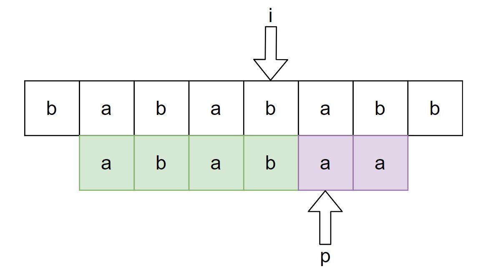
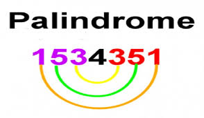
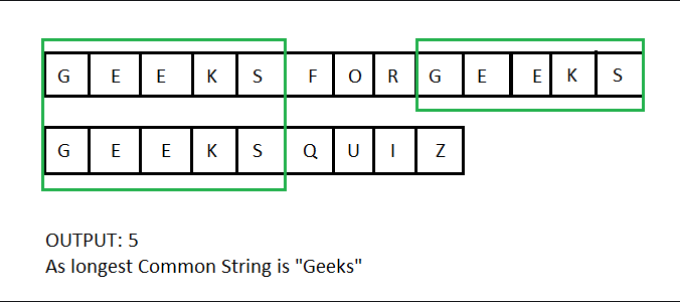

# Entregable 1 :books:
***
## Integrantes del equipo :bust_in_silhouette:
| Nombre | Github |
| ------------- | ------------- |
| Manu Camacho  | https://github.com/manu-capa  |
| German Wong  | https://github.com/germanwong  |
| Iván Álvarez  | https://github.com/IvanAlvarez15 |
***
## ¿Cómo probarlo? :rocket:
### Compilar el código :bug:
Asegurese de tener **c++** instalado en su sistema, para poder compilar el código en su terminal. Asegurandose de estár dentro de la carpeta del proyecto.
``` 
g++ main.cpp -o main
```
### Ejecutar el código :boom:
```
./main
```

## Descripción :computer:


En equipos de máximo 3 personas, escribe un programa en C++ que lea 5 archivos de texto (de nombre fijo, no se piden al usuario) que contienen exclusivamente caracteres del **0 al 9, caracteres entre A y F y saltos de línea**.

- Los archivos de **transmision** contienen caracteres de texto que representan el envío de datos de un dispositivo a otro.

- Los archivos **mcodex.txt** representan ***código malicioso*** que se puede encontrar dentro de una transmisión.


```diff
+ transmission1.txt
+ transmission2.txt
- mcode1.txt
- mcode2.txt
- mcode3.txt
```
<p align="center">
  
</p>


***
## PARTE 1 - Knuth Morris Pratt Algorithm :diamond_shape_with_a_dot_inside:

El programa debe analizar si el contenido de los archivos **mcode1.txt, mcode2.txt y mcode3.,txt** están contenidos en los archivos **transmission1.txt y transmission2.txt** y desplegar un ***true*** o ***false*** si es que las secuencias de chars están contenidas o no.

En caso de ser ***true***, muestra ***true***, seguido de exactamente un espacio, seguido de la posición en el archivo de **transmissiónX.txt** donde inicia el código de **mcodeY.txt**
<p align="center">
  
</p>

## PARTE 2 - Palindrome Check :diamond_shape_with_a_dot_inside:

Suponiendo que el código malicioso tiene siempre código "espejeado" ***(palíndromos de chars)***, sería buena idea buscar este tipo de código en una transmisión.

El programa después debe buscar si hay código "espejeado" dentro de los archivos de transmisión. ***(palíndromo a nivel chars, no meterse a nivel bits)***. El programa muestra en una sola linea dos enteros separados por un espacio correspondientes a la posición (iniciando en 1) en donde inicia y termina el código "espejeado" más largo (palíndromo) para cada archivo de transmisión. 

Puede asumirse que siempre se encontrará este tipo de código.
<p align="center">
  
</p>

## PARTE 3 :diamond_shape_with_a_dot_inside:

Finalmente el programa analiza que tan similares son los archivos de transmisión, y debe mostrar la posición inicial y la posición final (iniciando en 1) del primer archivo en donde se encuentra el substring más largo común entre ambos archivos de transmisión.
<p align="center">
  
</p>

***
### Input :inbox_tray:
```
    nada, solamente deben existir los 5 archivos 
    en la misma ruta donde se ejecuta el programa    
```
### Output :checkered_flag:
#### Parte 1 :white_check_mark:
```
    (true | false) si es que el archivo transmission1.txt contiene el código (secuencia de chars) contenido en el archivo mcode1.txt    
    (true | false) si es que el archivo transmission1.txt contiene el código (secuencia de chars) contenido en el archivo mcode2.txt
    (true | false) si es que el archivo transmission1.txt contiene el código (secuencia de chars) contenido en el archivo mcode3.txt
    (true | false) si es que el archivo transmission2.txt contiene el código (secuencia de chars) contenido en el archivo mcode1.txt
    (true | false) si es que el archivo transmission2.txt contiene el código (secuencia de chars) contenido en el archivo mcode2.txt
    (true | false) si es que el archivo transmission2.txt contiene el código (secuencia de chars) contenido en el archivo mcode3.txt
```
#### Parte 2 :white_check_mark:
```
    posiciónInicial posiciónFinal (para archivo de transmisión1)
    posiciónInicial posiciónFinal (para archivo de transmisión2)
```
#### Parte 3 :white_check_mark:
```
    posiciónInicial posiciónFinal (de substring común más largo entre archivos de transmisión)
```
## Desarrollo de trabajo :coffee:

Podemos guardar el contenido de transmission 1 y transmission 2 en diferentes strings para compararlos en kmp y checkPalindrome, pero esto presenta una limitación. Principalmente si queremos obtener el index de donde se encuentra el patrón de kmp o el su palíndromo, estos nos darían un index de archivos de más de 1,000,000 de caracteres respectivamente en promedio para un archivo de transmission de 1000 líneas, y aunque no rebasamos el límite supuesto para un string en c++ el cual es 4,294,967,295 caracteres, preferimos guardar cada string encontrado en cada salto de línea en un vector, para poder conseguir el número de línea junto a su índice, de esta manera facilitamos la lectura de datos para el usuario.

